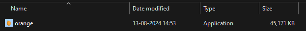
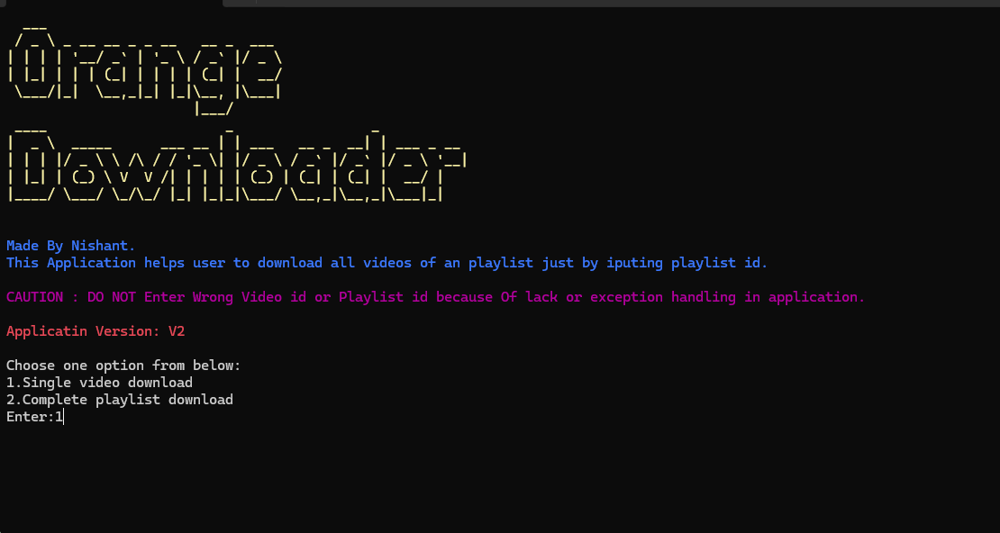

# YouTube Playlist Downloader V2

A Python tool to download YouTube playlists.
Older Verison has been updated with newer one where I have solved the problem of no audio issue after downloading video. Now you dont have to click on links to download you just have to open the exe file and input playlist id it will automatically download the files in your folder where the exe is present. 

## Features

- Download entire YouTube playlists.
- Audio issues solved
- Version 2
- Less time consuming
- Single video download option added

## Installation

1. Clone the repository:
   ```bash
   git clone https://github.com/tadano13/youtube-playlist-video-downloader.git
   ```
2. Navigate to the project directory:
   ```bash
   cd youtube-playlist-video-downloader
   ```
## Required Libraries

- Open Command prompt and install all these libraries.

1. Install `requests` library:<br>
```sh
pip install requests
```
2. Install `python-dotenv` library:<br>
```sh
pip install python-dotenv
```
3. Install `y2mate-api` library:<br>
```sh
pip install y2mate-api
```
4. Install `pyfiglet` library:<br>
```sh
pip install pyfiglet
```
5. Install `termcolor` library:<br>
```sh
pip install termcolor
```

## Usage

1. For `API_KEY` go to https://rapidapi.com/ytjar/api/yt-api and then subscribe to the basic free plan which gives you 500 requests per day.<br>

2. Create a `.env` file in the root directory with the following content:
```env
API_KEY=your_api_key
```
3. move to dist folder.<br>
4. Download all files properly.<br>
5. you will see orange.exe file double click on it.<br>
   <br>
   
6. You will see prompt like given below follow instructions on it enter one of the option like shown below..
   <br>
   
7. If you see any error like the picture given below, Make sure your internet connection  is good and your api limit is not exceeded.
   <br>
   
8. You can get playlist code in url when you open a playlist it will look like the example given below
   <br>

9. You can get video id of video as shown below
    
   - Or you can check this video which can help you finnding it. https://youtu.be/liJVSwOiiwg?si=KeSMQ5HYjpc7O_5i
   
10. Follow the prompts to input the playlist URL code and other settings.<br>

11. Make sure you follow all instructions properly.

## REFRENCES

- Y2mate library : (https://pypi.org/project/y2mate-api/) <br>
  This library helped a lot while building this project. This library provides You commands which let you download youtube video in highest quality. You should take a look at it for sure.

## CONCLUSION 
- Benifits of this repository is you dont have to deal with ads which you get on other websites while trying to download playlist. It is safe secure none of your data is being tracked and api is good too.
- If you like my work i would apppreciate a star and if you think you can modify add something better it will be very helpful.
## ISSUE
- The only issue in above program is Exception handling i havent implemented exception handling in all cases but there are some which will handle exceptions from api data. Lack of exception handling might be only issue with the application.

